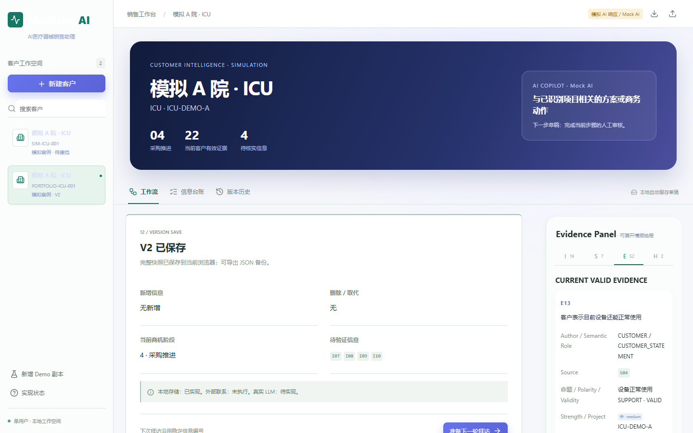
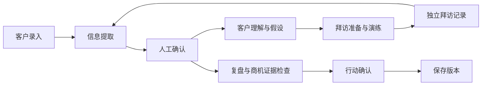
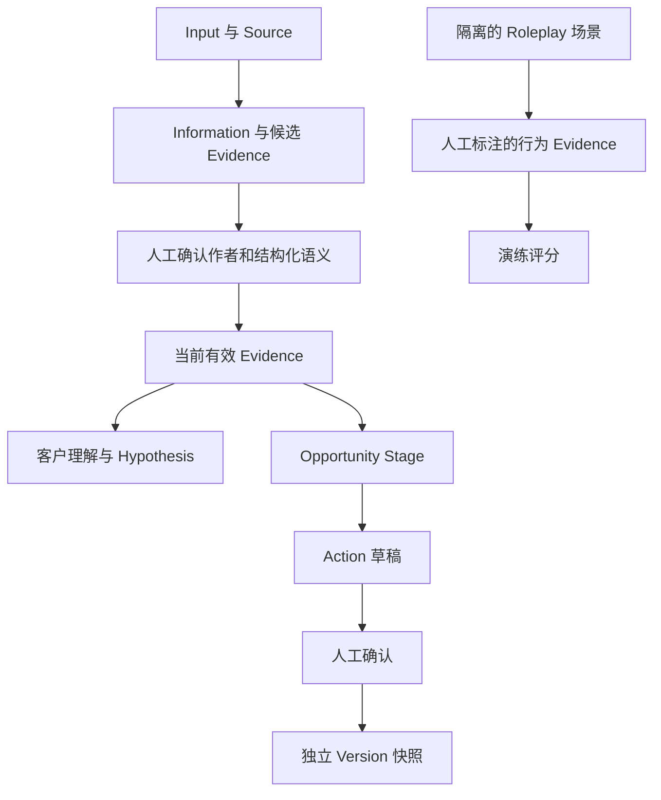

# MedSales AI


**AI Medical Device Sales Copilot · AI医疗器械销售助手**

基于大语言模型工作流思想设计的医疗器械销售辅助与训练原型，用于客户理解、拜访准备、销售复盘和基于证据的商机判断。

技术：原生 JavaScript / CSS + Node.js + localStorage。特别设计：Evidence 驱动、人工确认、反证重算与独立版本快照。

**Portfolio Prototype / Mock AI / 单用户本地运行。** 当前没有接入真实 LLM。不是生产级医疗系统、医疗建议系统或自动采购系统。全部展示案例为 SIMULATED，不含真实医院采购、客户或患者数据。

[8 分钟 Demo](docs/portfolio/demo-script.md) · [产品架构](docs/portfolio/product-architecture.md) · [Evidence 模型](docs/portfolio/evidence-model.md) · [已知限制](docs/portfolio/limitations.md)



## 1. Project Overview

面向医疗器械销售人员的客户分析与拜访训练工作台。把客户表达、销售判断、AI 推测和来源分别记录，再经过人工结构化确认，形成可解释、可回溯的商机判断。

## 2. Why I Built It

我是一名云南中医药大学生物制药专业的 2027 届本科生，已有医疗产品销售、客户沟通与市场开拓实践，希望向医疗行业销售、产品或市场方向发展。本项目用于探索如何把销售流程理解转化为可操作的 AI 辅助工作流；它不代表真实企业部署或经量化验证的销售业绩。

## 3. Problem

销售笔记中的“客户说设备还能用”“我觉得客户可能想换设备”和“AI 推测存在采购机会”很容易混在一起。若没有来源和审核边界，维护痛点可能被夸大成采购项目，旧判断也可能在反证出现后继续影响行动。

## 4. Solution

核心原则是 **Customer Statement ≠ Sales Inference ≠ AI Inference**。Mock 先整理候选信息，人核对作者、命题方向、项目和出处，系统再基于有效 Evidence 生成假设、检查阶段门槛。人最终决定行动。

## 5. Core Workflow



这是循环工作流示意，实际状态顺序和拜访后审核回路见 [业务流程](docs/portfolio/business-workflow.md)。演练回答不会自动进入拜访记录。

## 6. Evidence-Driven Design

Information 与 Source 保留原文和出处；Evidence Object 表达作者、命题、极性、有效性、强度、项目及反证关系。业务门槛读取经过验证的 Evidence 关系，不靠“采购”等关键词直接升级。

`VALID` 表示符合原型内部校验条件，不表示客观事实已获外部独立核验。客户转述仍是客户转述，重复同源记录不等于更强证据。

## 7. Opportunity Stage

| Stage | 名称 | 当前 V1.1 门槛摘要 |
|---|---|---|
| 0 | lead only | 尚无满足更高阶段的有效证据 |
| 1 | initial contact | 有相关客户沟通 |
| 2 | needs confirmed | 明确改善需求，无未解决反证 |
| 3 | project identified | 更新意向、项目范围、参与者、内部动作 |
| 4 | procurement advancing | Stage 3 的项目证据，加启动、流程、权限、采购节点 |
| 5 | commercial/solution stage | 已识别项目及正式方案/商务动作 |
| 6 | won/lost | 可核验且无相反结果冲突的成交/失单依据 |

Stage 是当前证据满足的门槛，不是成交概率，也不是强制逐级累加。Stage 5 的实现不要求逐项重复 Stage 4 全部条件。预算虽在十维检查中展示，但不是当前 Stage 4 的独立硬门槛；不要把原型规则当成医院通用采购制度。

## 8. Human-in-the-loop

用户可接受、修改、删除或标记待验证。接受原文不等于确认全部业务含义：未审核的语义仍是 UNKNOWN。要支持业务判断，需要在编辑中确认结构化命题和方向，再接受该条。动作修改后也需再次接受，才能保存新版本。

## 9. V1 → V2 → V3

固定模拟案例“医疗器械设备更新机会”：V1 保存首次审核资料，展示维护痛点及需求假设；独立模拟拜访补足项目/采购证据，形成 V2 Stage 4；后续客户纠正“此前采购启动的说法不准确”，原启动 Evidence 失效，重新计算为 V3 Stage 3。刷新后当前状态保持，历史 V2 仍为 Stage 4。

V1 在首次审核时保存，商机可能尚未评估；不能把未评估渲染成已确认的 Stage 0。只有采购启动条件被反证、其余项目门槛仍成立时，示例才降至 Stage 3。

## 10. Roleplay

规则驱动的模拟客户按话题和上下文逐步回应，支持科室主任、医生、设备科、采购、管理人员角色。响应时长与故障频次分开；未知预算、采购节点不补造。评分依据人工结构化标注的整轮行为 Evidence，不是通用 NLP 自动测评。无依据确定性断言不会被后续正确提问抵销。

## 11. Multi-project Isolation

Evidence 绑定 customer/project，并在使用时检查项目范围；A 项目证据不能直接支持 B 的项目门槛。多项目隔离有回归覆盖，但当前界面不是完整多项目 CRM；不要把底层隔离能力描述成多用户权限系统。

## 12. Demo

前提：已安装 Node.js；冻结验证使用 **v24.19.0**。在项目根目录运行，无需安装应用依赖：

```sh
node server.mjs
```

打开 [http://127.0.0.1:4173](http://127.0.0.1:4173)。若已占用，PowerShell 可指定另一端口：

```powershell
$env:PORT='4174'
node server.mjs
```

`npm start` 在 npm 可用时等价。不要直接双击 HTML：应用使用 ES Modules。页面内“新增 Demo 副本”是初始维护场景，不会自动加载已完成的 Stage 4；完整演示资料与审核步骤见 [Demo Script](docs/portfolio/demo-script.md)。演示前预演，不用临场编造采购信息。

## 13. Architecture



阶段不是从假设标题推导；它与假设共同使用有效 Evidence。动作是预设模板加引用，当前没有 LLM 自由规划。详见 [实际模块职责](docs/portfolio/product-architecture.md)。

## 14. Tech Stack

| 层 | 当前实现 |
|---|---|
| 前端 | 原生 JavaScript ES Modules、HTML、CSS；无 React/Vue/Vite |
| 图标 | 本地 Lucide 脚本 |
| 状态/持久化 | 浏览器内存 + localStorage；JSON 导入/导出 |
| 本地服务 | Node.js 内置 http/fs/path 静态文件服务 |
| AI | 规则与有限语义、人工结构化确认的 Mock AI；无真实 LLM API |
| 验证 | node:test/assert；Playwright + Chrome 浏览器脚本 |

应用运行无需第三方包安装。既有浏览器验收脚本使用原开发机的 Playwright/Chrome 绝对路径，不应描述成任意机器开箱即跑的 CI。可按 [截图说明](docs/portfolio/SCREENSHOT_PLAN.md) 配置文档取图工具。

## 15. Testing

以下为 [最终冻结验证摘要](docs/portfolio/freeze-verification.md) 的结果，不是在线 CI 徽章：

| 项目 | 冻结验证 |
|---|---|
| 当前业务和新增回归 | 30/30 PASS |
| 浏览器完整工作流、V1→V2→V3 | PASS |
| Stage 4→3、历史保护、刷新 | PASS |
| 多项目、移动端、Hero、favicon | PASS |
| Console / Network | PASS |
| 全部历史测试集合 | 80 项：51 PASS，29 旧契约不兼容 FAIL |

```sh
node --test tests/round5.test.mjs tests/round9.test.mjs tests/round10.test.mjs
node --test tests/*.test.mjs
```

第二条包含保留的旧断言，预期仍有失败；`npm test` 使用同样的全量命令。30/30 **不是全部历史测试通过**。旧测试没有被修改或删除；分类说明见 [验证摘要](docs/portfolio/freeze-verification.md)。

## 16. Known Limitations

单用户、本地存储、Mock AI、有限场景、人工语义确认；不具备通用 NLP、生产级医疗数据接入或真实医院采购系统集成。不能用于真实医疗决策或真实客户敏感数据。UI 中仍有技术字段和手动审核负担；版本快照是程序层独立拷贝，不是防篡改数据库。完整说明见 [limitations.md](docs/portfolio/limitations.md)。

## 17. Future Direction

当前只计划整理作品集、讲解材料与后续发布准备。真实 LLM、外部系统、线上部署均不属于 V1.1 已实现能力，也未在本轮执行。

## 18. Project Status

**V1.1 — FROZEN · Portfolio Prototype**。核心逻辑停止迭代。本轮只整理文档与真实截图，没有修改 source、tests 或业务规则。欢迎围绕证据边界、销售流程和人工审核的设计取舍讨论。

v1.1.0 发布材料已准备，尚未创建远程仓库或发布标签。[Release Notes](docs/portfolio/RELEASE_NOTES_v1.1.0.md) · [发布范围与待处理项](docs/portfolio/release-scope.md)。Licensed under the MIT License. Copyright (c) 2026 He Jiale.

## License

MIT License.

See [LICENSE](LICENSE).
