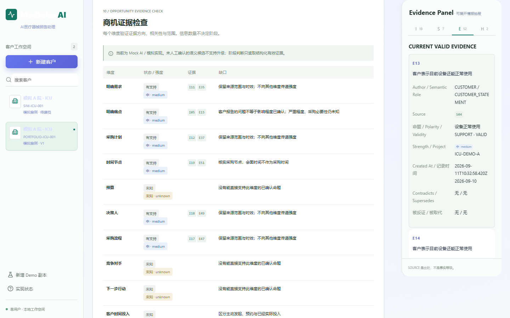
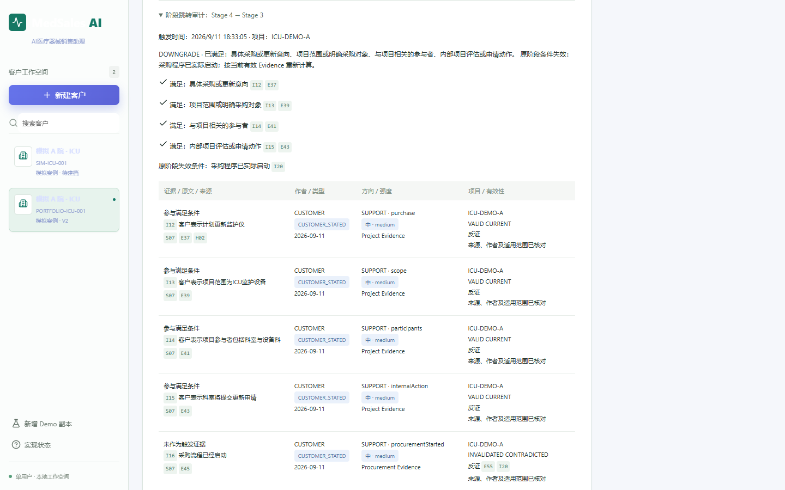

# MedSales AI

## Evidence-Driven AI Copilot for Medical Device Sales

**基于证据的医疗器械销售 AI Copilot**：面向医疗器械销售人员，把客户沟通转化为有来源、可审核、可更新的销售判断，帮助确定下一次拜访应验证什么。

**V1.1.0 · FROZEN · Portfolio Prototype · Mock AI**

Customer Understanding → Visit Preparation → Roleplay → Evidence Review → Opportunity Assessment → Action Confirmation → Versioned Follow-up

**Customer Statement ≠ Sales Inference ≠ AI Inference**

[Demo](#demo) · [Architecture](docs/portfolio/product-architecture.md) · [Evidence Model](docs/portfolio/evidence-model.md) · [Business Workflow](docs/portfolio/business-workflow.md) · [Limitations](#limitations) · [Release Notes](docs/portfolio/RELEASE_NOTES_v1.1.0.md)


## Why I Built It

我是云南中医药大学生物制药专业的 2027 届本科生，有医疗产品销售、客户沟通和市场开拓实践，希望进入医疗器械、医药或医疗科技行业，向销售、产品、市场方向发展。

这个项目探索如何把医疗器械销售流程转化为 AI-assisted workflow：从整理客户表达，到核实需求、准备拜访，再到根据新证据调整商机判断。它是个人可运行原型，不代表企业部署、医院试用或已经取得的商业业绩。

## The Problem

销售笔记中的客户表达、销售理解和 AI 推测，容易被混成同一个“事实”。下面是一个**模拟的错误推理链**：

| 信息层 | 示例 | 能否证明采购项目？ |
|---|---|---|
| 客户表达 | “设备还能使用，但维护协调比较麻烦。” | 只能说明客户报告了使用现状和维护问题 |
| 销售判断 | “客户近期可能需要更换。” | 需要进一步核实 |
| AI 推测 | “存在采购机会。” | 不能据此确认采购项目 |

**维护痛点 ≠ 采购项目；销售判断 ≠ 客户事实；AI 推测 ≠ 已验证事实。**

销售人员需要看见每条判断的出处、支持与反证，以及下一步还缺什么信息，而不只是获得一段听起来合理的建议。

## What Makes It Different

| Design | What it does |
|---|---|
| Evidence Object | 记录作者、命题、极性、来源、强度、有效性及客户/项目范围 |
| Human-in-the-loop | 原文和结构化语义分别审核；AI 推测不能直接成为阶段依据，行动必须由人确认 |
| Contradiction-aware | 关联同项目、同命题的反证，使不再成立的旧证据失效 |
| Opportunity Stage | 根据当前有效证据重新计算 Stage，解释为什么、缺什么；不输出成交概率 |
| Version snapshots | V1/V2/V3 保存当时状态，当前判断变化不会回写历史快照 |
| Roleplay isolation | 模拟演练回答不自动进入正式客户证据或拜访记录 |
| Multi-project isolation | 检查项目范围，防止借用其他项目证据推进阶段 |

接受记录原文不等于确认全部业务含义；未审核语义仍为 UNKNOWN。VALID 仅表示通过原型内部校验，不代表外部真实性已被独立核实。完整字段与边界见 [Evidence Model](docs/portfolio/evidence-model.md)。

## A Key Scenario

**模拟案例 / Demo Data：三级医院 ICU 监护设备更新。** 以下机构、角色和采购信息均为模拟设定，不涉及真实医院、客户或患者。

| 时点 | 新信息与人工审核 | 系统如何更新判断 |
|---|---|---|
| V1 · Initial customer understanding | 初次确认设备仍可使用、维护协调存在问题 | 保存初始资料；随后生成客户理解与需求假设，采购阶段可能尚未评估 |
| V2 · Additional procurement evidence | 独立模拟拜访补足更新意向、范围、参与者、内部动作及采购启动、流程、权限、节点证据 | 满足阶段门槛，形成 Stage 4：procurement advancing |
| Customer correction | 客户纠正：“此前采购启动的说法不准确。”并经过人工审核 | 同项目的采购启动支持证据失效，保留反证关联 |
| V3 · Recalculated opportunity | 采购启动条件不再满足，其他项目识别条件仍成立 | 当前阶段重算为 Stage 3：project identified；历史 V2 仍保留 Stage 4 |

**新证据可以推翻旧判断，沟通次数增加不代表商机阶段一定升高。** Stage 4→3 来自具体条件变化，不是遇到反证就固定减一级；维护痛点本身不会触发采购升级。





V1 在首次信息审核时保存，不保证已有假设或阶段评估。查看 [完整演示脚本](docs/portfolio/demo-script.md) 了解独立拜访记录、再审核、行动确认和版本保存的实际步骤。

## Demo

前提：安装 Node.js；冻结验证使用 **v24.19.0**。在项目根目录运行，无需安装应用依赖：

```sh
node server.mjs
```

打开 [http://127.0.0.1:4173](http://127.0.0.1:4173)。npm start 在 npm 可用时等价。若端口占用，PowerShell 可另设端口：

```powershell
$env:PORT='4174'
node server.mjs
```

选择模拟客户或新增 Demo 副本，按 [约 8 分钟的讲解脚本](docs/portfolio/demo-script.md) 演示。该时长是预演目标，不是测量得到的新手操作耗时。新 Demo 从初始维护场景开始，不会直接加载 Stage 4；演练与独立模拟拜访记录分开。

应用使用 ES Modules，需要本地服务。当前没有线上 Demo；GitHub 发布的是源码、文档和演示素材。

## Tech Stack

| 用途 | 当前技术 |
|---|---|
| 前端原型 | JavaScript ES Modules、HTML/CSS、Lucide |
| 本地运行与存储 | Node.js 静态服务、浏览器 localStorage |
| 验证 | node:test、Playwright / Chrome |
| AI 工作流 | 规则驱动的 Mock AI、人工结构化语义确认；未连接真实 LLM |

技术面试可从 [Architecture](docs/portfolio/product-architecture.md) 查看模块职责，从 [Business Workflow](docs/portfolio/business-workflow.md) 查看审核回路，再结合 [设计取舍](docs/portfolio/design-decisions.md) 讨论输入成本、证据边界和历史保护。

## Testing

以下为已有冻结及后续验证记录，不是实时 CI 状态；本次 README 编辑未重新运行业务验收。

| Check | Recorded result |
|---|---|
| Current business and regression | **30/30 PASS** |
| Browser full workflow | PASS |
| V1 → V2 → V3 | PASS |
| Stage 4 → Stage 3 / contradiction | PASS |
| Historical snapshot protection / refresh | PASS |
| Multi-project isolation | PASS |
| Mobile | PASS |
| Console / Network | PASS |
| Historical full suite | **80 items: 51 PASS / 29 FAIL（legacy contract incompatibilities）** |

30/30 仅指当前业务和新增回归，**不是全部历史测试通过**。历史断言和失败记录均保留。

```sh
node --test tests/round5.test.mjs tests/round9.test.mjs tests/round10.test.mjs
node --test tests/*.test.mjs
```

第二条包含历史不兼容断言，预期有失败；npm test 使用全量命令。详见 [冻结验证摘要](docs/portfolio/freeze-verification.md)。

四个旧浏览器脚本已完成个人路径可移植性修复，但仍需安装 Playwright/浏览器并配置环境。Round 2.5 实际运行中，三个因旧 scoring contract 失败，一个通过；路径修复没有修改断言。当前配置与结果见 [Browser Path Portability](docs/portfolio/browser-path-portability.md)。

## Limitations

- Single-user / Local prototype / Mock AI：无真实 LLM API、真实医院采购集成或 CRM 接口。
- No patient data / No real customer confidential data：展示资料全部为模拟案例，未使用真实患者或客户机密信息。
- Human confirmation required：语义确认和行动需要人工审核；演练评分依赖人工行为标注，不是通用 NLP 能力测评。
- Not medical advice / Not a production healthcare system：不能用于医疗决策、自动采购或真实敏感数据处理。
- localStorage 与 JSON 快照不是加密、防篡改或生产级审计存储；多项目隔离不等于多用户权限系统。
- Stage 是原型内部证据门槛，不是医院通用采购制度或成交概率。UI 仍有技术字段、低对比度和手动录入负担。

更多边界见 [Limitations](docs/portfolio/limitations.md)；该早期文档的个人路径限制已由后续 [Round 2.5 路径修复记录](docs/portfolio/browser-path-portability.md) 更新。

## What This Project Demonstrates

| 能力 | 可以检查或演示的产出 |
|---|---|
| 医疗行业与销售流程理解 | 区分维护问题、改善需求与采购项目，用角色、流程、权限和时间节点设计验证问题 |
| AI workflow design / Product thinking | 把客户理解、演练、复盘和行动组织成有人工门槛的可运行流程 |
| Evidence modeling / Human-in-the-loop design | 信息归因、来源引用、语义审核、反证和项目隔离 |
| 前端原型实现 | 可操作的工作台、本地保存、版本历史和模拟演练 |
| Testing and validation / 迭代开发 | 用回归和浏览器验证检查边界，同时保留历史失败与已知限制 |

这个作品展示的是：**把医疗器械销售中的判断问题，转化为产品流程、证据约束和可运行原型的能力。** 不以项目名称代替职业资历，也不声称已有模型训练、真实商业转化或企业部署成果。

## Project Status

**V1.1.0 — FROZEN · Portfolio Prototype**

V1.1.0 is publicly released on [GitHub](https://github.com/genelimarayo-droid/medsales-ai/tree/v1.1.0). 核心业务逻辑已冻结，当前用于 Portfolio、Interview Demo、Product discussion 和医疗器械销售流程探索。

[Release Notes](docs/portfolio/RELEASE_NOTES_v1.1.0.md) 保留发布准备时的说明，标题中的草稿状态属于历史记录；当前源码及 v1.1.0 标签已公开。源码发布不代表线上 Demo 部署或生产就绪。

## License

Licensed under the MIT License. Copyright (c) 2026 He Jiale.

See [LICENSE](LICENSE). 第三方图标保留其 [原许可声明](src/vendor/lucide.LICENSE)。
