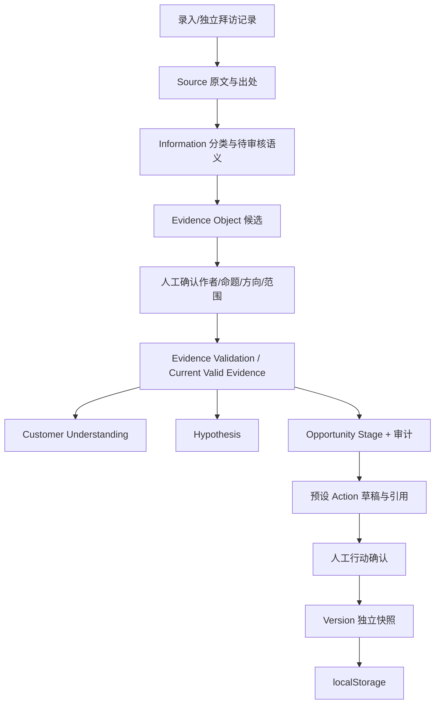

# Product Architecture

## 真实技术结构

浏览器运行 ES Modules，Node.js 只负责静态文件。没有业务后端、云数据库、登录体系或真实 LLM 代理服务。



这是概念数据流，不表示每一步都自动执行或每次动作都调用模型。确认信息原文与确认结构化语义是两件事。状态机会约束操作顺序。

## 模块与依据

| 文件 | 实际职责 |
|---|---|
| [app.js](../../src/app.js) | DOM、事件、表单、localStorage、JSON 备份；无 LLM 调用 |
| [core.js](../../src/core.js) | 状态机、提取/审核、客户理解、假设、计划、复盘、行动、快照 |
| [semantics.js](../../src/semantics.js) | 有限归因、拆句和语义候选，正式判断须使用验证关系 |
| [maintenance-frames.js](../../src/maintenance-frames.js) | 响应时长与频次的量纲候选，不能当作已验证事实 |
| [evidence.js](../../src/evidence.js) | Evidence 对象、语义审核、有效性及反证/取代关系 |
| [evidence-validation.js](../../src/evidence-validation.js) | 作者、来源、时间、客户和项目校验，提供可用关系 |
| [opportunity.js](../../src/opportunity.js) | 十维证据检查、阶段门槛、解释与人工复核校验 |
| [roleplay.js](../../src/roleplay.js) | 独立 Mock 场景和人工行为 Evidence 评分 |
| [presentation.js](../../src/presentation.js) | 只读 Hero 摘要投影 |
| [server.mjs](../../server.mjs) | 127.0.0.1 静态文件服务及 MIME 类型 |

## 易误解的边界

- Hypothesis 和 Stage 都依赖有效 Evidence；Stage 不因假设“看起来合理”而自动升级。
- Roleplay 使用独立 `ROLEPLAY_ONLY` 行为 Evidence；正式客户 Evidence 不因演练回复自动增加。
- `makeActions` 是模板式草稿与引用，不是自主销售 Agent。最终动作需要人工接受。
- 信息审核和版本落盘不会同步到医院、CRM 或云端。
- 快照使用 JSON 深拷贝；能保护程序内当前状态不回写历史，但无法防止用户直接编辑本地存储。

## 项目结构

```text
README.md
package.json / server.mjs
src/                 # 已冻结应用和本地图标
tests/               # 当前与保留的历史测试
work/                # 仅本地开发机验收工具，不纳入发布
outputs/             # 仅本地原始验收记录，不纳入发布
docs/portfolio/      # 本轮作品集说明与真实截图
```
